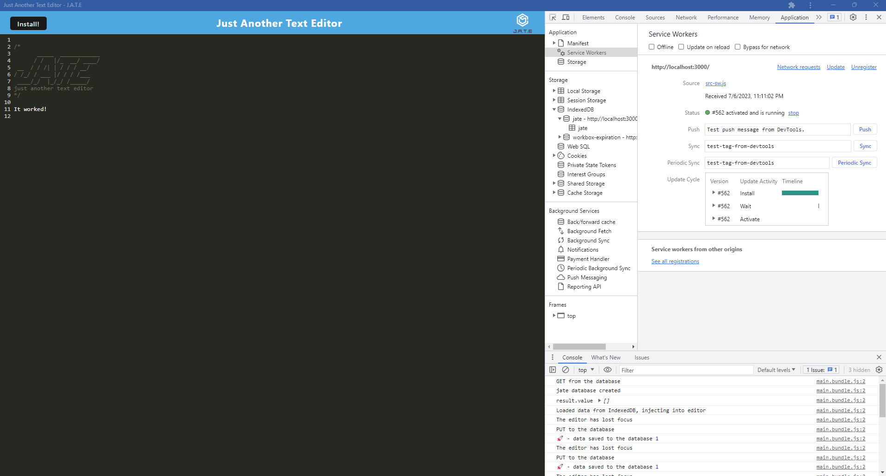

# HW-Challenge-19-PWA-Text-Editor

## Description

As a developer I want to create notes or code snippets with or without an internet connection so that I can reliably retrieve them for later use.

## Main Objectives

- When I open my application in my editor, I should see a client server folder structure
- When I run `npm run start` from the root directory, I find that my application should start up the backend and serve the client
- When I run the text editor application from my terminal, I find that my JavaScript files have been bundled using webpack
- When I run my webpack plugins, I find that I have a generated HTML file, service worker, and a manifest file
- When I use next-gen JavaScript in my application, I find that the text editor still functions in the browser without errors
- When I open the text editor, I find that IndexedDB has immediately created a database storage
- When I enter content and subsequently click off of the DOM window, I find that the content in the text editor has been saved with IndexedDB
- When I reopen the text editor after closing it, I find that the content in the text editor has been retrieved from our IndexedDB
- When I click on the Install button, I download my web application as an icon on my desktop
- When I load my web application, I should have a registered service worker using workbox
- When I register a service worker, I should have my static assets pre cached upon loading along with subsequent pages and static assets
- When I deploy to Heroku, I should have proper build scripts for a webpack application

## Links

Deployed application: https://pwa-pg-b06049823cea.herokuapp.com/

Repo: https://github.com/pg1219/HW-Challenge-19-PWA-Text-Editor

## Mock-Up

Preview image of deployed application

